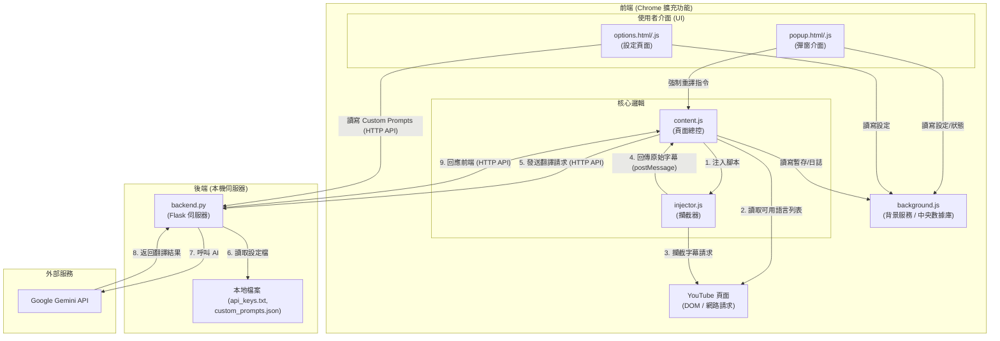
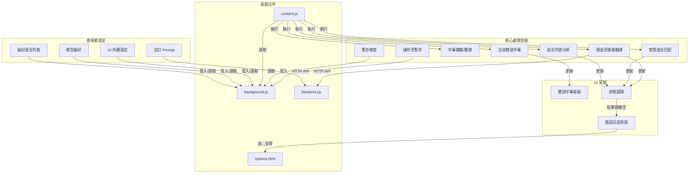

一、 總體架構圖
本擴充功能採用前後端分離架構，以確保穩定性與強大的功能擴展性。

二、 元件職責與數據流
前端 (Frontend)
manifest.json

主要職責：擴充功能的入口與定義檔，聲明所有元件、權限與規則。

數據抓取：無。

檔案互動：定義了 content.js, background.js, popup.html, options.html 等檔案的執行時機與權限。

content.js (前端總控制器)

主要職責：在 YouTube 頁面執行所有核心邏輯，包括偵測、決策、UI渲染和與後端的通訊。

數據抓取：

從 YouTube 頁面 DOM：在頁面載入時，優先抓取 ytInitialPlayerResponse 物件，解析出「所有可用的字幕語言列表」。這是擴充功能進行自動化決策的第一步。

從 injector.js：透過 window.postMessage 接收攔截到的原始字幕內容(JSON)和語言代碼。 在做出『需要翻譯』的決策後，透過攔截或主動請求的方式獲取原始字幕內容(JSON)。。

從 background.js：讀取使用者設定和影片字幕暫存。

從 backend.py：接收翻譯完成的字幕文字。

檔案互動：

調用 injector.js：將其注入到頁面中以啟動攔截。
content.js 在啟動時總是會注入 injector.js，使其處於待命狀態。
在「無可用匹配語言」或「忽略語言」的靜默模式下，injector.js 雖然已注入，但 content.js 會忽略其攔截到的訊息，直到使用者在播放器中手動切換到一個目標語言，content.js 才會響應。

調用 background.js：發送訊息請求儲存/讀取設定與暫存，並儲存錯誤日誌。

調用 backend.py：透過 fetch API，將待翻譯的字幕文本發送到後端 /api/translate 端點。

管理 style.css：注入的樣式表會作用於 content.js 動態建立的 UI 元件上。

接收 popup.js 的指令：會接收來自 popup.js 的「強制重譯」指令，並觸發自身的重新翻譯流程。

將捕獲到的技術性錯誤詳情 (例如 "API 金鑰已達用量超限")，發送到 background.js 進行儲存。

當使用者點擊紅色 ! 狀態圖示時，呼叫 chrome.runtime.openOptionsPage() API，觸發使用者去查看錯誤。

injector.js (數據攔截器)

主要職責：攔截 YouTube 播放器發出的 timedtext 網路請求。

數據抓取：從 YouTube 網路請求 中，直接捕獲字幕內容(JSON)和該請求的語言代碼(lang=xx)。

檔案互動：將捕獲到的數據透過 window.postMessage 傳送給 content.js。

background.js (中央資料庫)

主要職責：作為一個不會關閉的背景服務，儲存所有需要跨頁面、跨時間存在的數據。

數據抓取：從 content.js, popup.js, options.js 接收指令與數據。

檔案互動：

回應 content.js 的暫存與設定讀寫請求。

回應 popup.js 的全域開關狀態、設定讀取、以及接收來自 popup.js 的「清除特定影片暫存」的指令。

回應 options.js 的進階設定讀寫請求，以及錯誤日誌的讀取請求。

接收並儲存由 content.js 發送過來的最新一筆錯誤日誌訊息。

回應 options.js 的請求，提供已儲存的錯誤日誌訊息。

popup.js / options.js (設定介面邏輯)

主要職責：處理使用者在 UI 介面上的操作。

數據抓取：從使用者介面（如點擊、拖曳、輸入）獲取操作指令。

檔案互動：大部分設定（如UI選項、開關狀態）會透過 background.js 進行管理。部分需要與後端本地檔案互動的功能（如自訂 Prompt），則會直接與 backend.py 的 API 溝通。

options.js 在頁面載入時，會向 background.js 發送訊息，請求讀取最新儲存的錯誤日誌，並將其顯示在指定的日誌區域內。

[新增邏輯 - 強制重譯]：

當使用者在 popup.html 點擊「強制重譯」時，popup.js 首先會向 content.js 發送訊息，詢問「當前影片的 ID 是什麼？」。

拿到影片 ID 後，再向 background.js 發送指令「清除此 ID 的暫存」。

最後，再次向 content.js 發送指令「請立即重新翻譯」。

[修正 - 自訂 Prompt]：

options.js 在讀取和儲存「自訂 Prompt」時，是透過 fetch API 直接與 backend.py 的 /api/prompts/custom 端點溝通，因為 Prompt 內容是儲存在後端本地的 custom_prompts.json 檔案中。

而其他如字體大小、模型偏好等設定，則是透過 background.js 進行儲存。

後端 (Backend)
backend.py (翻譯引擎)

主要職責：接收前端的翻譯請求，呼叫 Gemini API 進行翻譯，並返回結果。

數據抓取：

從 content.js：接收待翻譯的文本列表、語言、模型偏好等資訊。

從 Google Gemini API：接收翻譯結果。

從本地檔案 api_keys.txt 和 custom_prompts.json：讀取 API Key 和使用者自訂的 Prompt。

檔案互動：回應 content.js 的 HTTP 請求。

三、 狀態訊息全覽
| 狀態 (State) | 訊息/UI呈現 | 出現位置 | 定義與觸發條件 |
| :--- | :--- | :--- | :--- |
| **等待中 (Waiting)** | (不顯示任何 UI) | 影片畫面 | `content.js` 已啟動，但尚未偵測到任何符合條件的字幕，處於靜默觀察模式。 |
| **翻譯中 (Translating)** | `[ % ]` 進度圓環 | 影片右上角 | 已成功匹配到目標語言，`content.js` 正在向後端發送請求並等待返回。 |
| **翻譯成功 (Success)** | `[ ✓ ]` 圖示 (短暫顯示後淡出) | 影片右上角 | 後端成功返回翻譯結果，`content.js` 已完成渲染。 |
| **取用暫存 (Cached)** | `[ ✓ ]` 圖示 (短暫顯示後淡出) | 影片右上角 | `content.js` 在 `background.js` 中找到了有效的暫存，直接渲染，未呼叫後端。 |
| **無可用匹配 (No Match)**| (不顯示任何 UI) | 影片畫面 | `content.js` 分析完影片可用字幕，發現沒有任何一個在使用者設定的「偏好翻譯列表」中。 |
| **忽略語言 (Ignored)** | (不顯示任何 UI) | 影片畫面 | 偵測到的字幕語言在「忽略列表」中（例如 `zh-Hant`）。 |
| **等待中 (Waiting)** | **(不顯示任何 UI)** | 影片畫面 | `content.js` 已啟動，但分析後發現當前影片的字幕語言不在「偏好翻譯列表」中，或在「忽略列表」中，因此處於靜默觀察模式。 |
| **翻譯中 (Translating)** | **`[ % ]` 進度圓環** | 影片右上角 | 已成功匹配到目標語言，`content.js` 正在向後端發送請求並等待返回。進度根據已翻譯/總句數計算。 |
| **翻譯成功 (Success)** | **`[ ✓ ]` 綠色圖示** (短暫顯示後淡出) | 影片右上角 | 後端成功返回翻譯結果，`content.js` 已完成渲染。 |
| **取用暫存 (Cached)** | **`[ ✓ ]` 綠色圖示** (短暫顯示後淡出) | 影片右上角 | `content.js` 在 `background.js` 中找到了有效的暫存，直接渲染，未呼叫後端。 |
| **無可用匹配 (No Match)** | **(不顯示任何 UI)** | 影片畫面 | `content.js` 分析完影片可用字幕，發現沒有任何一個在使用者設定的「偏好翻譯列表」中。 |
| **忽略語言 (Ignored)** | **(不顯示任何 UI)** | 影片畫面 | 偵測到的字幕語言在「忽略列表」中（例如 `zh-Hant`）。 |
| **技術性錯誤 (Error)** | 紅色 `[ ! ]` 圖示 (持續顯示，可點擊) | 影片右上角 | 翻譯過程中發生可被使用者介入解決的錯誤之通用提示。點擊後跳轉至 Options Page 日誌區。 |
| ↳ **錯誤日誌詳情** | (以下為不同錯誤類型對應的詳細文字) | **Options Page 日誌區** | 使用者點擊 `!` 圖示後，在此處看到的具體錯誤原因。 |
| | `[翻譯失敗：無法連線至後端]` | Options Page 日誌區 | `content.js` 的 fetch 請求無法觸及 `127.0.0.1:5001`。 |
| | `[翻譯失敗：API 金鑰錯誤或用量超限]` | Options Page 日誌區 | `backend.py` 嘗試了所有 API Key 都無法成功翻譯。 |
| | `Error: ...` | **瀏覽器 Console** | `content.js` 捕捉到錯誤時印出，供開發者偵錯。 |
| | `錯誤: ...` | **後端 CMD 視窗** | `backend.py` 發生錯誤時印出，供開發者偵錯。 |

四、 總功能清單 (包含待實作)
核心翻譯功能 (Core Translation)
即時字幕攔截與翻譯：自動攔截 YouTube 字幕，並呼叫後端進行翻譯。

雙語字幕顯示：在影片畫面上建立自訂圖層，同步顯示原文與翻譯字幕。

智慧語言匹配 (待實作)：自動分析影片所有可用字幕，並根據使用者設定的偏好語言列表，自動選擇最佳語言進行翻譯。

影片級暫存機制：自動將翻譯結果以影片 ID 為單位進行暫存，加速二次觀看。

使用者介面與體驗 (UI/UX)
自訂字幕外觀：提供選項調整字幕的字體大小與字型。

顯示模式切換：可獨立開關原文或翻譯字幕的顯示。

狀態圓環 (待實作)：在影片右上角以圖示化方式（%, ✓, !）提供低干擾的即時狀態回饋。

穩定降級機制：在任何翻譯失敗的情況下，優先保證原文字幕的正常顯示。

原生字幕管理：在擴充功能接管時，自動隱藏 YouTube 原生字幕，避免畫面重疊。

客製化與控制 (Customization & Control)
全域功能開關：在彈出視窗中提供總開關，一鍵啟用或停用擴充功能。

偏好語言管理 (待實作)：使用者可自訂偏好翻譯的語言及其優先順序（例如：1. 日文, 2. 英文）。

忽略語言列表 (待實作)：使用者可設定在任何情況下都不進行翻譯的語言（例如：繁體中文）。

AI 模型偏好管理：使用者可透過拖曳方式，自由排序想要優先使用的 Gemini 模型。

客製化 Prompt：支援分語言（日/韓/英）自訂翻譯風格指南與專有名詞對照表。

強制重新翻譯：在彈出視窗中提供按鈕，可手動清除當前影片的暫存並觸發全新翻譯。

後端與診斷 (Backend & Diagnostics)
多 API Key 備援：支援設定多個 Gemini API Key，並在單一 Key 失敗或額度用盡時自動輪換。

API Key 診斷 (待實作)：在設定頁面提供按鈕，可一鍵測試所有已設定 API Key 的有效性。

錯誤日誌系統：當發生可由使用者介入的錯誤時，狀態圓環會提示，點擊後可在設定頁面看到詳細的錯誤日誌。

五、核心功能架構圖

六、主要使用者流程圖
1. 成功自動翻譯流程 (Happy Path)
程式碼片段

sequenceDiagram

    participant User as 使用者
    participant Content as content.js
    participant Backend as backend.py
    participant UI as 狀態圓環/字幕

    User->>Content: 載入有日文字幕的影片
    Content->>Content: 分析頁面，找到可用字幕['ja', 'en']
    Content->>Content: 匹配使用者偏好 (ja)，決策成功
    Content->>UI: 顯示 `[ % ]` 狀態圓環
    Content->>Content: 獲取日文字幕內容
    Content->>Backend: 發送日文文本進行翻譯
    Backend->>Backend: 呼叫 Gemini API
    Backend-->>Content: 返回中文翻譯結果
    Content->>UI: 渲染雙語字幕
    Content->>UI: 狀態圓環顯示 `[ ✓ ]` 並淡出

2. 無可用匹配語言流程
程式碼片段

sequenceDiagram

    participant User as 使用者
    participant Content as content.js
    participant UI as 影片畫面

    User->>Content: 載入只有法文字幕的影片
    Content->>Content: 分析頁面，找到可用字幕['fr']
    Content->>Content: 匹配使用者偏好 (ja, en)，無一命中
    Content->>UI: **(保持靜默，不顯示任何UI)**
    User->>UI: 正常觀看 YouTube 原生法文字幕

3. 技術性錯誤處理流程
程式碼片段

sequenceDiagram

    participant User as 使用者
    participant Content as content.js
    participant Backend as backend.py
    participant UI_Orb as 狀態圓環
    participant UI_Options as Options Page

    User->>Content: 載入影片，觸發翻譯
    Content->>UI_Orb: 顯示 `[ % ]` 狀態圓環
    Content->>Backend: 發送翻譯請求
    Backend-->>Content: 返回 API Key 失效錯誤 (503)
    Content->>UI_Orb: 更新為紅色 `[ ! ]` 圖示
    Content->>Content: 將錯誤詳情儲存至 background.js
    
    User->>UI_Orb: 點擊 `[ ! ]` 圖示
    Content->>UI_Options: 打開設定頁面
    UI_Options->>UI_Options: 從 background.js 讀取錯誤日誌並顯示

七、 錯誤處理機制

| 錯誤/情境 | 自動處理機制 | 使用者應對措施 |
| :--- | :--- | :--- |
| **無可用匹配語言** | 擴充功能**自動靜默**，不進行任何翻譯或 UI 操作，將字幕控制權完全交還給 YouTube 原生播放器。 | **無需任何操作**。使用者可正常觀看影片的原生字幕。 |
| **忽略語言 (如繁中)** | 擴充功能**自動靜默**，處理方式同上。 | **無需任何操作**。 |
| **後端伺服器未開啟** | `content.js` 的 `fetch` 請求失敗，進入 `catch` 區塊。狀態圓環會變為**紅色 `[ ! ]`**。詳細錯誤訊息「無法連線至後端」會被儲存。 | 1. 查看 `[ ! ]` 圖示，確認問題。 2. 點擊 `[ ! ]` 查看日誌。 3. **手動啟動** `backend.py` 伺服器。 4. 點擊彈出視窗中的「強制重新翻譯」按鈕重試。 |
| **API Key 失效/超限** | `backend.py` 在嘗試完所有可用 Key 後依然失敗，會返回一個明確的錯誤給 `content.js`。狀態圓環會變為**紅色 `[ ! ]`**。詳細錯誤訊息會被儲存。 | 1. 點擊 `[ ! ]` 查看日誌，確認是 API Key 問題。 2. **手動檢查** `api_keys.txt` 檔案中的 Key 是否正確、是否還有額度。 3. (待實作) 在設定頁面點擊「測試 API Key」按鈕進行診斷。 4. 修正 Key 後，點擊「強制重新翻譯」重試。 |
| **單次網路波動** | `fetch` 請求可能超時或失敗。處理方式同「後端伺服器未開啟」，狀態圓環變為紅色 `[ ! ]`。 | 1. 檢查自身網路連線。 2. 點擊字幕區出現的「點此重試」連結，或點擊「強制重新翻譯」進行完整的重試。 |